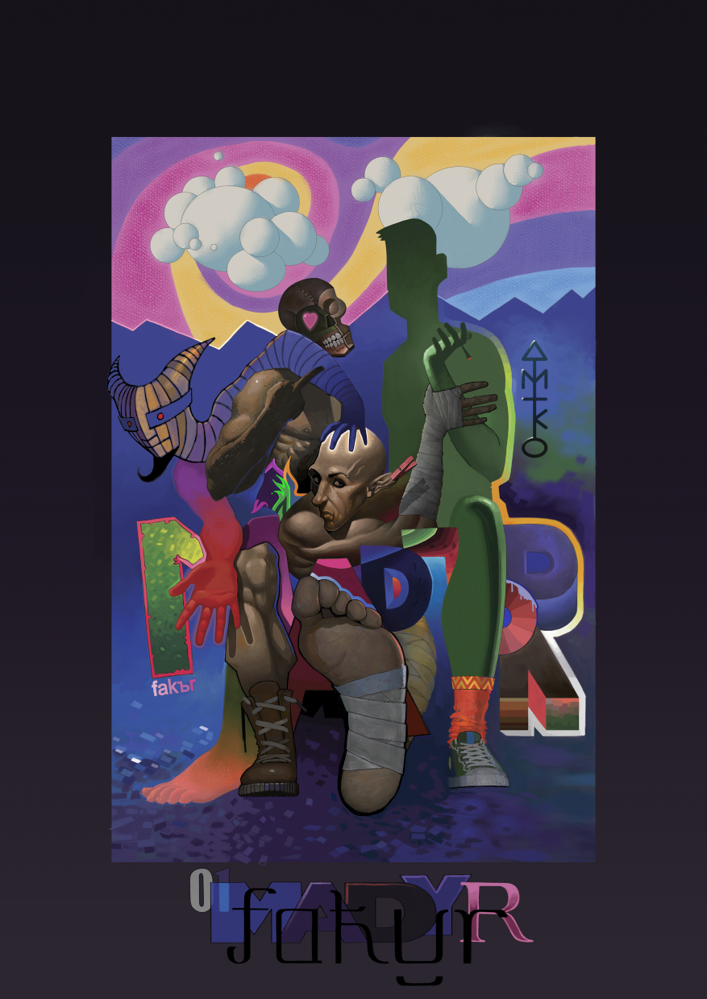

Prob *3* [[clck]](https://ioinformatics.org/files/ioi1991round1.pdf); <- Someone knows how to use
semicolons?, this problem is nice short and sweet. From a given square position we
can move in all directions: **N NE E SE S SW W NW**;
once I've saw in a chess program the board represented
as framed *12x12* matrix to handle Knight moves; the same idea is used here.

[[瞳を忘れないで]](https://www.youtube.com/watch?v=AiTymo5O7B4&t=5476s)
