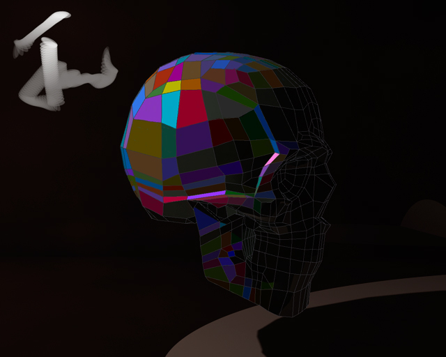

### :)

**Sqr Prob** [[clck]](https://ioinformatics.org/files/ioi1991round1.pdf);
In Chess Programming it's customary to represent the board as framed,
*12x12* matrix to handle Knight's moves in a general way. Here we use the same
idea, and instead of *5x5* we work with extended *11x11* matrix,
althoug from a given position we move much more like Kings, in all
directions.

[[Rain]](https://youtu.be/izakfWqWVVE)
